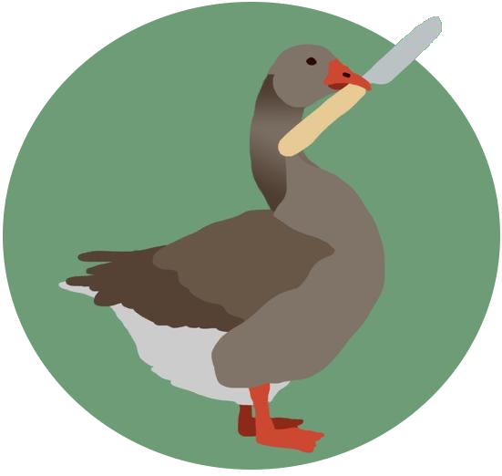

**YOU** are a goose. You love crimes. It's the village fete weekend. Your flock is gonna bring the whole damn thing crashing down and honk over the ashes, spreading your beautiful wings and basking in a good time truly fucked up. By you. A goose.

## **PLAYERS**: create your **GOOSE**

1. Choose your **GOOSE NUMBER**, from 2 to 5. A high number means you’re better at **HONKS** (being loud, destructive, angry, direct). A low number means you’re better at **HIDES** (sneaking, running, making friends).

2. Roll 3D6 and pick one entry from each (or just choose!):

|Breed                              |Role               |Gear                                                   |
|---                                |---                |---                                                    |
|1. Embden Goose: Scare             |1. Thief           |1. A pretty bow                                        |
|2. American Buff Goose: Strength   |2. Brains          |2. A glass bottle                                      |
|3. Bar-headed Goose: Run           |3. Scientist       |3. A KNIFE (it’s a harmless butter knife BUT STILL)    |
|4. Egyptian Goose: Allure          |4. Face            |4. A sharpie                                           |
|5. Tolouse Goose: Escape Artist    |5. Muscle          |5. A golden bell                                       |
|6. White-fronted Goose: Hide       |6. Agent Of Chaos  |6. 240v Electromagnetic Device Scrambler (one use only)|

## **GOAL**: Ruin the Village Fete

The village fete is this weekend. It will culminate with a big event, which it is your goal to ruin by whatever means necessary. You have one day to make your plans and lay your schemes, then during the final grand ceremony spring your **GOOSEY TRAP**! Your motivation is up to you, maybe the quality of thrown bread has been poor, maybe the humans have ruined your ancient ceremonial rites for the last time, whatever it is you are going to absolutely ruin this final ceremony. Think Carrie. But with **GEESE**.

As a **GOOSE** you can only talk to other waterfowl. This means your flock, ducks, swans etc. You explicitly cannot communicate with humans outside of honks or flaps. Head points might work to a friendly human.

## **ROLLS**: Roll the dice when you do something risky.

 Roll 1d6 to find out how it goes. Roll +1d if you’re prepared and +1d if you’re good at the thing you're trying, or if you have a tool that can help. (The GM tells you how many dice to roll, based on your character and the situation.)

Roll your dice and compare each die result to your **GOOSE NUMBER**. If you’re using **HONKS** (being loud, destructive), you want to roll under your number. If you’re using **HIDES**, (sneaking, communicating) you want to roll over your number.

* If none of your dice succeed, it goes wrong. The GM says how things get worse somehow.
* If one die succeeds, you barely manage it. The GM inflicts a complication, harm, or cost.
* If two dice succeed, you do it well. Good job!
* If three dice succeed, you get a critical success! The GM tells you some extra effect you get!

If you roll your **GOOSE NUMBER** exactly, you have connected with the essential goosiness of the universe and get a special insight into what’s going on. You may ask the GM a question and they’ll answer you honestly, or you can just count it as a single success. Some good questions: Where are the Mayor’s car keys? How many geese will I need to lift the drain cover? Is Billy really not afraid of me or is he just frontin’? Will the ducks agree to a truce? You can change your action if you want to, then roll again.

If you want to help someone else, who’s rolling, say how you try to help and make a roll. If you succeed, give them +1d.

## **GM**: Create The Fete

|The village is famous for…         |Your antagonist is…                |The final ceremony of the fete is…             |
|---                                |---                                |---                                            |
|1. Flower displays                 |1. The nebbish neighbourhood watch |1. Measuring of the world’s biggest sunflower  |
|2. Model village                   |2. The burly pub landlord          |2. Presentation of a giant renovation cheque   |
|3. Traction engine                 |3. The huffy town mayor            |3. A speech by the mayor                       |
|4. Locally crafted artisan pies    |4. The calculating police sergeant |4. A pie eating contest                        |
|5. The plague                      |5. The prim museum docent          |5. A play by the schoolchildren                |
|6. Sizable duck pond               |6. Duck gang!!                     |6. Unveiling a brand new duck hotel            |

---

By Neil Holmes (2019).

Shamelessly stolen from [Honey Heist](https://gshowitt.itch.io/honey-heist) by Grant Howitt and [Lasers & Feelings](http://onesevendesign.com/lasers_and_feelings_rpg.pdf) by John Harper and [Untitled Goose Game](https://goose.game/) by House House. Name is a pun on the awesome [Be Gay Do Crimes](https://saftware.itch.io/be-gay-do-crimes) by Evan Saft.

Art by [Kate Crashed](https://www.instagram.com/kate_crashed/).

 This work is licensed under a <a rel="license" href="http://creativecommons.org/licenses/by-nc-sa/4.0/">Creative Commons Attribution-NonCommercial-ShareAlike 4.0 International License</a>.